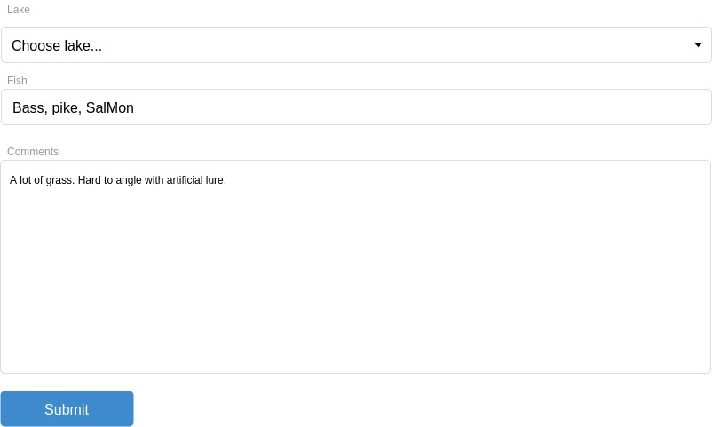

Fishing lakes
=====

Your task is to create a single page application for "Fishing association" which allows people to submit what fish they
have caught in which lake. One fish type can be caught in multiple lakes and in one lake can be caught multiple types of fish.
The "Fishing association" need to have all lakes in one table and all unique fish in other table to be able to tell
which fish live in which lake. We assume that lakes are already in table. Its up to you to add them. But fish are unknown
and have to be created when added in system. For UI specific requirements reference the mockup image.

You are given a Symfony project. You need to implement this application in it.

